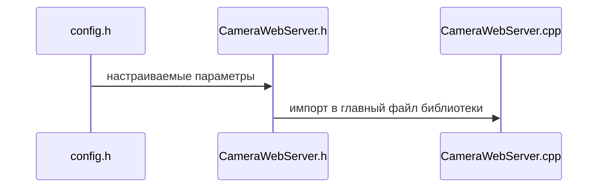

<h1>Библиотека для развертки простого веб-сервера на esp32-cam AI-thinker</h1>

<ul>
    <title>
    оглавление
    </title>
    <li>
        <p>
            <a  href = "#s_1" style="color: rgb(35,162,145">
            Способ применения
            </a>
        </p>
    </li>
    <li>
        <p>
            <a href="#s_2" style="color: rgb(35,162,145)">
                Высокоуровневые функции
            </a>
        </p>
    </li>
    <li>
        <p>
            <a href="#s_3" style="color: rgb(35,162,145">
                Функции-обработчики uri
            </a>
        </p>
    </li>
    <li>
        <p>
            <a href="#s_3" style="color: rgb(35,162,145">
                Редактируемые параметры
            </a>
        </p>
    </li>
    <li>
        <p>
            <a href="#s_6" style="color: rgb(35,162,145">
                Организации файлов библиотеки
            </a>
        </p>
    </li>
</ul>

<hr>
<h2 id = "s_1">
    <center> Способ применения <center>
</h2>
Для использования неоходимо использовать один из следующих редакторов кода <code>Visual Studio</code>, <code>Visual Studio Code</code>, <code>CLion</code>. В редакторе кода необходимо установить расширение PlatformIO и открыть папку с "проекта". При установленном расширении прочитается конфигурацонный файл сборки проекта platformio.ini и откроется доступ к инструментам, которые позволяют выполнять сборку, загрузку и монитор порта.
<h2>

<h2 id="s_2" style="color: rgb(35, 162, 145)">
    <center>Высокоуровневые функции</center>
</h2>

Функция  инициализации камеры

``` C
/**
 * \brief Функция настройки камеры
 * \param [in] framesize разрешение 
 * \param [in] jpeg_quality степень сжатия jpeg: 0 <= jpeg_quality <= 63
 * меньше число - больше качество, рекомендуемое значение - ~20+
 * \return None
 */
void camera_init(framesize_t framesize,  unsigned char jpeg_quality);
```
Функция запуска веб-сервера
``` C
/**
 * \brief Функция включения Esp в режим WiFi хаба
 * \param [in] ssid имя сети
 * \param [in] password пароль от сети
 * \param [in] local_ip ip платы в сети
 * \param [in] debug_mode при true выводит fps и температуру в Serial Monitor при просадках (инициализация не происходит в файле библиотеки, необходимо инициализировать Serial в вызывающем файле)
 * \return None
 **/
void start_stream(char* ssid, const char* password,IPAddress local_IP, bool debug_mode);
```

<h2 id="s_3" style="color: rgb(35, 162, 145)">
    <center>Функции-обработчики uri</center>
</h2>

Функция обработки uri /stream

```C
/**
 * \brief Обработка uri /stream
 * \param [in] req входящий запрос с клиентской части
 * \return код ошибки ESP
 **/
static esp_err_t stream_handler(httpd_req_t *req);
```

<h2 id="s_4" style="color: rgb(35, 162, 145)">
    <center>Низкоуровневые функции</center>
</h2>

Функция старта сервера
```C
/**
 * \brief запуск сервера со стандартными параметрами, линковка функций-обработчиков к адресам
 * \return None
 **/
void startCameraServer();
```

<h2 id="s_5" style="color: rgb(35, 162, 145)">
    <center>Редактируемые параметры</center>
</h2>
макросы для разметки пинов

```C
// инициализирует пины (прописано отдельно чтобы при смене модели камеры
// можно было достать макросы из exaple'а)

#define PWDN_GPIO_NUM  32
#define RESET_GPIO_NUM -1
#define XCLK_GPIO_NUM  0
#define SIOD_GPIO_NUM  26
#define SIOC_GPIO_NUM  27

#define Y9_GPIO_NUM    35
#define Y8_GPIO_NUM    34
#define Y7_GPIO_NUM    39
#define Y6_GPIO_NUM    36
#define Y5_GPIO_NUM    21
#define Y4_GPIO_NUM    19
#define Y3_GPIO_NUM    18
#define Y2_GPIO_NUM    5
#define VSYNC_GPIO_NUM 25
#define HREF_GPIO_NUM  23
#define PCLK_GPIO_NUM  22
```

макрос для задания разделителя кадров в стриме

```C
#define PART_BOUNDARY "123456789000000000000987654321"
```

<h2 id="s_6" style="color: rgb(35, 162, 145)">
    <center>Организации файлов библиотеки</center>
</h2>


Ниже представлена смеха взаимодействия файлов библиотеки при сборке программы.
<table border="0">
<col width="2000" height="400">
    <tr>
        <th align="center">



</th>
    </tr>
    <tr>
        <th>
            <b><p style="text-align: center; font-size: 10pt">
                Рис. 1. Смеха взаимодействия файлов библиотеки
            </p></b>
        </th>
    </tr>
</table>